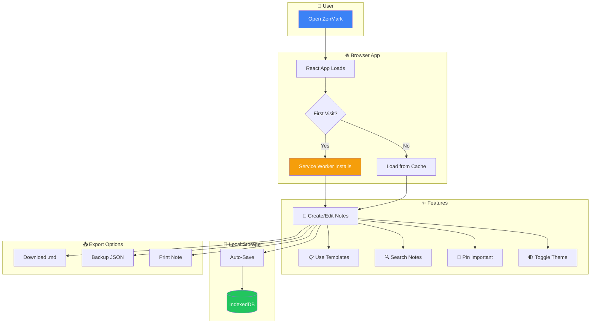
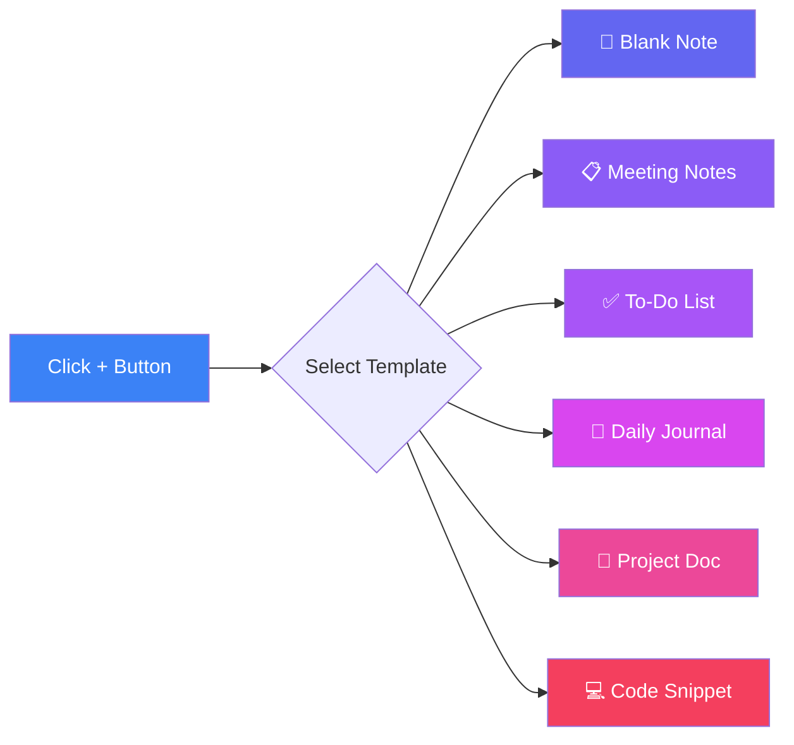
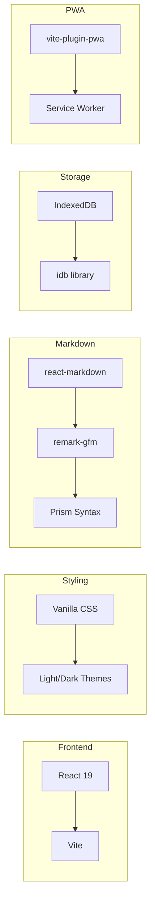

<div align="center">

# ✨ ZenMark

### A Lightweight Browser-Based Markdown Note-Taking App

*No servers. No sign-ups. Just open and write.*

[](https://github.com/n4itr0-07/ZenMark/actions/workflows/deploy.yml)
[](https://github.com/n4itr0-07/ZenMark/actions/workflows/docker.yml)
[](https://opensource.org/licenses/MIT)

<p align="center">
  <strong>📱 Installable PWA</strong> • <strong>🪶 Lightweight</strong> • <strong>📴 Works Offline</strong> • <strong>🔒 Privacy-First</strong>
</p>

> **Your notes never leave your browser.** ZenMark stores everything locally in IndexedDB. Once loaded, it works even if you turn off your internet!

---

</div>

## 🗺️ How ZenMark Works



## 🚀 Features

| Feature                     | Description                                               |
| --------------------------- | --------------------------------------------------------- |
| 📝 **Full Markdown Support** | Headers, lists, tables, code blocks, and more             |
| 👁️ **Live Preview**          | Real-time rendering with split view                       |
| 🎨 **Syntax Highlighting**   | 60+ languages with copy button                            |
| 📌 **Pin Notes**             | Keep important notes at the top                           |
| 🌓 **Light & Dark Themes**   | Toggle with Alt+T                                         |
| 📋 **Note Templates**        | 6 templates: blank, meeting, todo, journal, project, code |
| ⏱️ **Reading Time**          | Estimated reading time based on word count                |
| 📄 **Duplicate Notes**       | Create copies of existing notes                           |
| 🎯 **Focus Mode**            | Distraction-free writing (hide sidebar)                   |
| 🖨️ **Print Notes**           | Print formatted markdown                                  |
| ⌨️ **Keyboard Shortcuts**    | Ctrl+S save, Alt+N new note, Ctrl+B bold                  |
| 📥 **Import Files**          | Import .md and .txt files                                 |
| 📤 **Export & Backup**       | Download notes or backup all as JSON                      |
| 💾 **Local Storage**         | All data stored in IndexedDB - no server needed           |
| 📱 **PWA Support**           | Install as app on mobile/desktop                          |

## 🖥️ Demo

**Live Demo:** [https://zenmark.site](https://zenmark.site)

## ⌨️ Keyboard Shortcuts

| Shortcut           | Action                  |
| ------------------ | ----------------------- |
| `Ctrl + S`         | Save note               |
| `Alt + N`          | Create new note         |
| `Alt + T`          | Toggle light/dark theme |
| `Ctrl + B`         | **Bold** text           |
| `Ctrl + I`         | *Italic* text           |
| `Ctrl + K`         | Insert [link](url)      |
| `Ctrl + `` `       | `Inline code`           |
| `Ctrl + Shift + C` | ```Code block```        |
| `Ctrl + Shift + S` | ~~Strikethrough~~       |
| `Ctrl + H`         | ## Heading              |
| `Ctrl + Shift + Q` | > Blockquote            |
| `Ctrl + Shift + L` | - List item             |

## 📋 Note Templates



## 🛠️ Tech Stack



- **Frontend:** React 19 + Vite
- **Styling:** Vanilla CSS with light/dark themes
- **Markdown:** react-markdown + remark-gfm
- **Code Highlighting:** react-syntax-highlighter (Prism)
- **Storage:** IndexedDB (via idb)
- **PWA:** vite-plugin-pwa
- **Icons:** lucide-react

## 📦 Installation

### Quick Start (npm)

```bash
# Clone the repository
git clone https://github.com/n4itr0-07/ZenMark.git
cd ZenMark

# Install dependencies
npm install

# Start development server
npm run dev
```

### 🐳 Docker

```bash
# Build the image
docker build -t zenmark .

# Run the container
docker run -d -p 8080:80 zenmark

# Open http://localhost:8080
```

### Docker Compose

```bash
# Start the application
docker-compose up -d

# Stop the application
docker-compose down

# Rebuild and start
docker-compose up -d --build
```

## 📂 Project Structure

```
ZenMark/
├── src/
│   ├── components/     # React components
│   │   ├── Editor.jsx      # Main editor with preview
│   │   ├── Sidebar.jsx     # Notes list & navigation
│   │   ├── AboutPage.jsx   # About page
│   │   └── Modal.jsx       # Reusable modal
│   ├── lib/
│   │   └── storage.js      # IndexedDB operations + templates
│   ├── styles/             # CSS files
│   ├── App.jsx
│   └── main.jsx
├── public/             # Static assets & PWA icons
├── Dockerfile          # Multi-stage Docker build
└── .github/workflows/  # CI/CD pipelines
```

## 🤝 Contributing

Contributions are welcome! Here's how you can help:

1. **Fork** the repository
2. **Create** a feature branch: `git checkout -b feature/amazing-feature`
3. **Commit** your changes: `git commit -m 'Add amazing feature'`
4. **Push** to the branch: `git push origin feature/amazing-feature`
5. **Open** a Pull Request

## 📄 License

This project is licensed under the MIT License - see the [LICENSE](LICENSE) file for details.

---

<div align="center">

Made with ❤️ by [n4itr0-07](https://github.com/n4itr0-07)

**⭐ Star this repo if you find it useful!**

</div>
